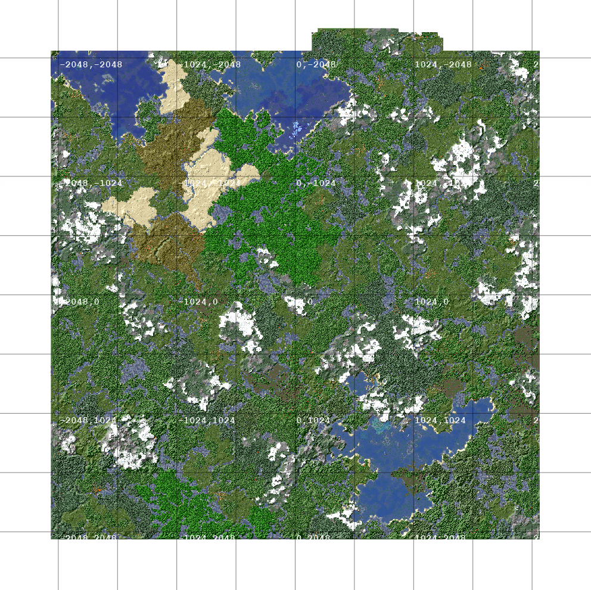
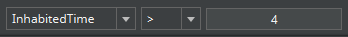
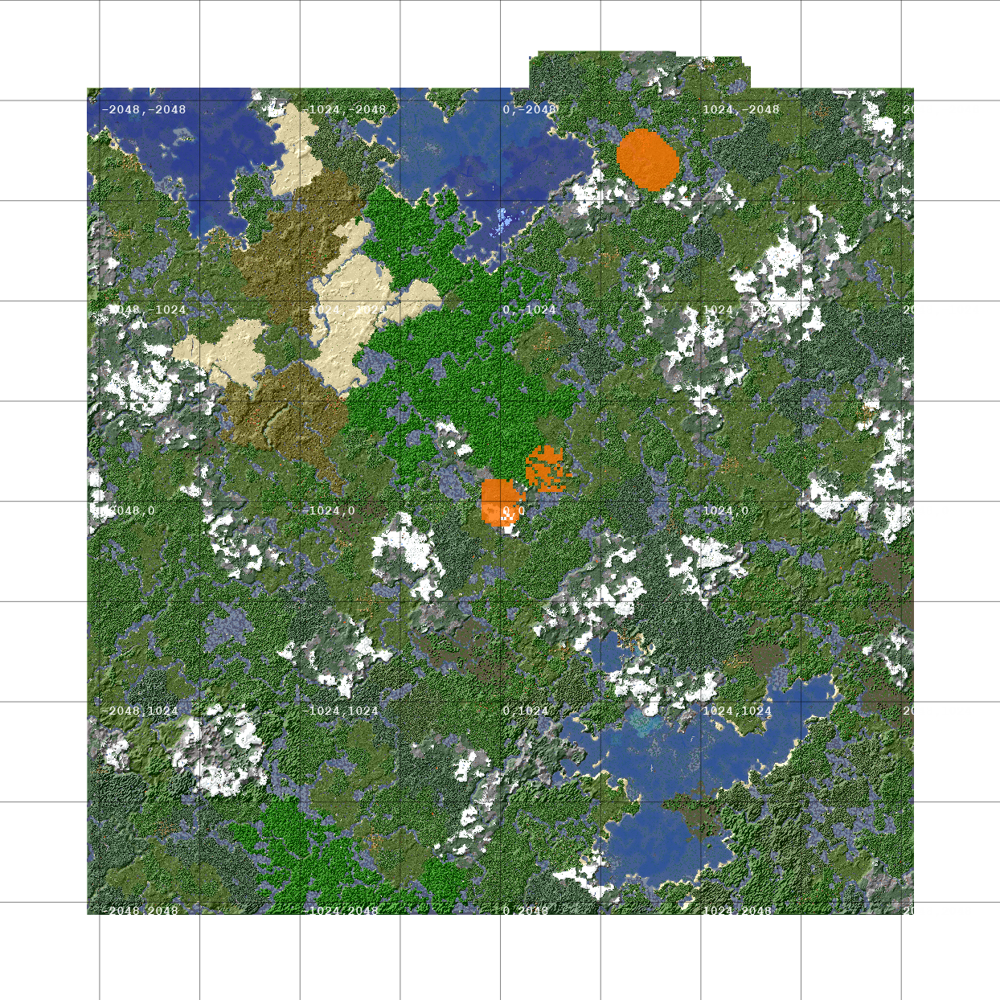
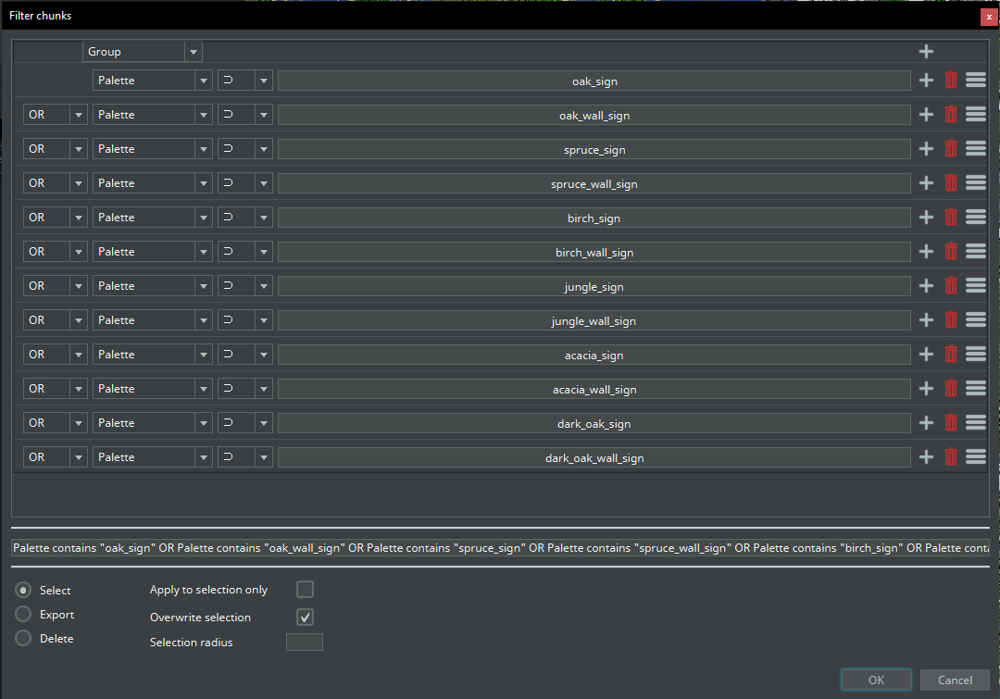
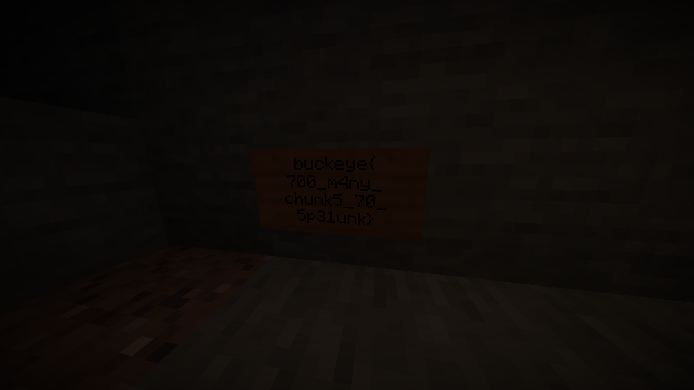

---
---

# Owl et spelunk

Revenons sur deux défis du BuckeyeCTF

---

## Owl

--

Qu'est-ce que c'est ?
: Bot discord
: Code source

--

### Fonctionnement d'un bot discord

Un bot discord utilise l'API de discord et est contrôlable depuis un server
distant à l'aide d'un programme en JS ou en Python.

> Il peut donc :
> : - Récupérer des messages
> : - Réagir aux messages
> : - Calculer des choses depuis le serveur

--

### Fonctionnement du bot

#### Connexion à l'API et setup

```js
const discord = require("discord.js");
const Browser = require("zombie");

const client = new discord.Client({ intents: 32767 });
client.login(
  "MTAzODQ0NTc1MDA1MDM3Nzg1OA.GAyFO9.cn4YPu1hpaCP2yzBTnuWGXVfbAVOUpELMp6OrA"
);

const browser = new Browser();
```

--

#### Récupération du message et traitement

```js
client.on("message", (msg) => {
  if (!(msg.channel instanceof discord.DMChannel)) return;

  let url =
    /https?:\/\/(www\.)?([-a-zA-Z0-9@:%._\+~#=]{1,256}\.[a-zA-Z0-9()]{1,6}\b)([-a-zA-Z0-9()@:%_\+.~#?&//=]*)/i;
  let match = msg.content.match(url);
  if (match) {
    scout(match[0], match[2]).then((res) => {
      if (res.length > 0) {
        msg.channel.send(res);
      }
    });
  } else {
    if (
      msg.content.toLowerCase().includes("owl") ||
      msg.mentions.has(client.user.id)
    ) {
      msg.channel.send("✨🦉 hoot hoot 🦉✨");
    }
  }
});
```

--

#### Scout

```js
function scout(url, host) {
  return new Promise((resolve, reject) => {
    if (!url.includes("owl")) {
      resolve("hoot... hoot hoot?");
      return;
    }

    browser.setCookie({
      name: "flag",
      domain: host,
      value: process.env.FLAG,
    });

    browser
      .fetch(url)
      .then((r) => {
        return r.text();
      })
      .then((t) => {
        return fly(url, t);
      })
      .then((m) => {
        resolve(m);
      });
  });
}
```

--

#### Visit

```js
function fly(url, content) {
  let bad = /<script[\s\S]*?>[\s\S]*?<\/script>/gi;

  return new Promise((resolve, reject) => {
    if (content.match(bad)) {
      resolve("hoot hoot!! >:V hoot hoot hoot hoot");
      return;
    }

    if (content.includes("cookie")) {
      resolve("hoooot hoot hoot hoot hoot hoot");
      return;
    }

    browser.visit(url, () => {
      let html = browser.html();
      if (html.toLowerCase().includes("owl")) {
        resolve("✨🦉 hoot hoot 🦉✨");
      } else {
        resolve("");
      }
    });
  });
}
```

---

### Résolution

1. Faire une page HTML sans scripts
2. Faire un serveur sur lequel le bot se connecte
3. Faire une page WEB avec script
4. Rediriger depuis la première page avec `<meta>`

--

#### Page html sans js

```html
<!-- Owl.html -->
<html>
    <head>
        <title>Owl</title>
        <meta http-equiv="refresh" content="0; url=https://<MonIP>:<Port>/js.html">
    </head>
    <body>
    </body>
</html>
```

--

#### Page avec script

```html
<!-- js.html -->
<html>
    <head>
        <title>Owl</title>
    </head>
    <body>
        <script>
            // J'ai perdu le script
            // Code volé sur internet pour avoir le cookie
            // Code volé pour faire une requête get sur mon serveur
        </script>
    </body>
</html>
```

---

## Spelunk

> Challenge minecraft

On a une map qui est donnée et on doit retrouver un panneau

--

## Deux méthodes

1. Trouver dans les NBT du texte
2. Trouver le panneau dans la map

--

### Étape 1: Voler des logiciels sur internet

> MCA Selector

Permet de lire le contenu d'un map graphiquement.

--

### Map obtenue

 {style="height: 70vh;"}

--

### Filtrage



 {style="height: 50vh;"}

--



--


--



---

## C'est tout pour cette fois

> Pas de compléments
