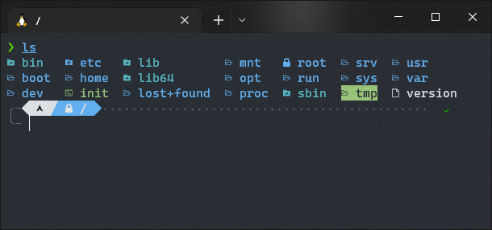

## Histoire {style="text-align: left; margin-left: 60px;"}

> Linux a été crée comme une alternative à Unix, équivalent propriétaire. Les systèmes d'exploitations basés sur Unix étant similaires à Linux sur de nombreux points.
> En effet, les logiciels de linux fonctionne souvent assez bien avec peut d'adaptation sur Mac par exemple.
>
> - Wikipedia

--

### En gros : {style="text-align: left; margin-left: 60px;"}

Linus Torvalds crée un logiciel permettant de faire tourner énormément d'OS et rend son travail libre et open-source.

On peut donc profiter de systèmes ressemblant à ce qu'on connaissait sous Unix mais en plus on peut créer absolument tout par dessus.

 {style="height:196px;"}

---

## Philosophie de linux

> "Tout est un fichier"

--

### Qu'est-ce que ça veut dire ?

- Tout est juste des suites de données (bytes stream)
- Un seul et unique protocole à faire et comprendre
- Grande interoperabilité et grande clarté

--

### Comment ça se traduit ?

Allons voir ça !

---

## Architecture

Comment sont organisés ces fichiers ?

--

### Racine

--

| Nom      | Utilité                                                          |
| -----    | ---------------------------------------------------------------- |
| /proc    | Retrouvez l'ensemble des processus en cours sur votre machine ici|
| /root    | Il n'y a rien pour vous ici. C'est le home du superutilisateur.  |
| /etc     | Retrouvez les fichiers de configuration de tout vos programmes.  |
|          | Si vous cherchez ou est la configuration par défaut, cherchez ici|
| /var     | Contient des fichiers voué à grandir (logs, crash reports, etc)  |
| /boot    | Ici réside votre bootloader,vous ne voudriez pas le blesser, non?|
| /mnt     | Vide. Vous pouvez y monter vos clef USB ou autres si besoin.     |
| /usr     | Trouvez tous les binaires, bibliothèques, documentation, etc...  |
| /sys     | Trouvez ici des informations sur votre système (batterie, etc...)|
| /srv     | Vous y trouverez pour vos données serveurs (http, etc...)        |
| /run     | Dossier sur la ram, permet de laisser des informations sur procs |
| /dev     | Retrouvez tout vos périphériques et stdin, stdout et stderr.     |
| /opt     | Mettez y les programmes que vous installez vous-même.            |
| /home    | On retrouve ici les répertoires personnels de vos utilisateurs.  |
| /tmp     | Répertoire poubelle, jetez y tout et tout disparaîtra au reboot. |
| /lib(64) | Répertoires avec des bibliothèques dedans. Vous n'y touchez pas !|
| /bin     | On y trouve les programmes les plus basiques de Linux (cat, ...) |
| /sbin    | Programmes basique pour la réparation du système (en user root)  |
| /media   | Pareil que /mnt mais plus utilisé par les systèmes par défaut    | {style="font-size: 20px;"}

---

## Sources

- [Linux wikipédia](https://en.wikipedia.org/wiki/Linux) - Communautaire
- [Linux n'est pas Unix ! L'histoire et l'origine des deux OS](https://youtu.be/baxmRgeX7-E) - Cocadmin
- ["Everything is a file" in UNIX](https://youtu.be/dDwXnB6XeiA) - Stevie Jay
- [Nom de code Linux [FR] - DOCUMENTAIRE](https://youtu.be/79_IMeks4wY)
- [Linux File System/Structure Explained!](https://youtu.be/HbgzrKJvDRw) -  DorianDotSlash

 {style="height: 196px; text-align: center;"}

---

## Mon github pour avoir les compléments

